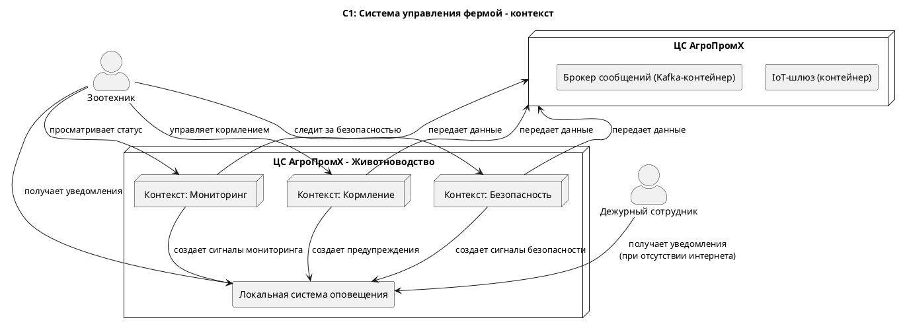
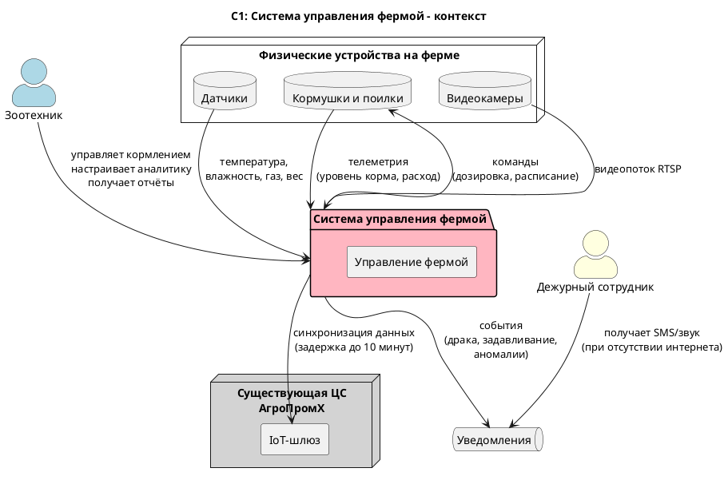

### **Название задачи: Автоматизация процессов связанных с кормлением, безопасностью и мониторингом поголовья скота.** 
### **Автор: Степан Дильман**
### **Дата: 28-03-2026**
### **Функциональные требования**
|**№**|**Действующие лица или системы**|**Use Case**|**Описание**|
| :-: | :- | :- | :- |
|1|Зоотехник/система|Детектирование беспокойства|фиксировать признаки беспокойного поведения или драк среди животных и оповещать оператора|
|2|Зоотехник/система|Детектирование задавливания|фиксировать признаки задавливания поросят|
|3|Система|Управление кормушками и поилками|управлять кормушками и поилками разных производителей|
|4|Зоотехник/Система|Оценка состояния животных|оценивать состояние животных по внешнему виду и поведению: болезнь, гибель, беспокойство и т.д.|
|5|Система|Мониторинг фильтрации воды|следить за состоянием систем фильтрации воды|
|6|Система|Пересчет поголовья|пересчитывать поголовье|
|7|Система|Управление запасами еды|следить за запасами еды и прогнозировать расход|
|8|Система|Видеомониторинг|поддерживать количество видеокамер для аналитики в реальном времени от разных производителей|
|9|Система/агенты|Архитектура ЦС-агенты|быть построена по принципу «центральный сервер — агенты» с поддержкой задержки до 10 минут|
|10|Система|Метрики|предоставлять базовые метрики для передачи в другие системы|
|11|Система|Пользовательские метрики|поддерживать возможность добавления собственных метрик|
|12|Система|Офлайн-режим|работать без интернета и синхронизироваться при восстановлении связи|
|13|Администратор|Роли и безопасность|иметь разделение ролей и поддерживать современные способы аутентификации и авторизации|
|14|Внешние приложения|API|иметь API для создания мобильного/веб-приложения|

### **Нефункциональные требования**
|**№**|**Требование**|
| :-: | :- |
|1|обеспечивать достаточно высокую отказоустойчивость 99,95%|
|2|быть расширяемой, то есть иметь возможность разработать новый функционал без изменений существующего|
|3|иметь высокую производительность — от момента возникновения нештатной ситуации, зафиксированной с помощью видеоаналитики, должно проходить не более 5 секунд до момента оповещения|
|4|позволять системе видеоаналитики реагировать в реальном времени (миллисекунды)|

### **Решение**
Приведите диаграммы контекста и контейнеров в модели C4. Опишите там основные компоненты и интеграции всех элементов решения.

Основным принципом при выборе архитектуры и технологий было максимальное использование возможностей существующей системы ЦС АгроПромХ, чтобы обеспечить целостность всей системы, снизить затраты на разработку и обучение персонала.

### **Альтернативы**

**Недостатки, ограничения, риски**

*Основное решение (распределенное)*
- Высокая масштабируемость — каждый контекст масштабируется независимо
- Отказоустойчивость — изоляция контекстов локализует сбои
- Расширяемость без изменений существующего — новый функционал добавляется как отдельный контекст

*Альтернативное решение (монолитное)*
- Быстрый вывод на рынок
- Низкий порог входа для команды — не требуются эксперты по распределённым системам
- Минимальные операционные затраты — один сервер и одна база данных вместо кластера

